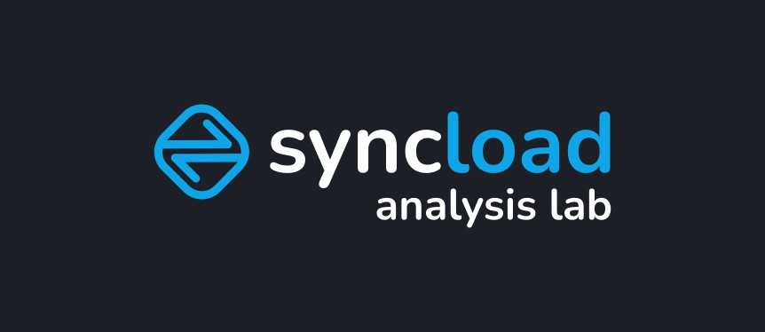

**Welcome to Syncload Analysis Lab** – the open-source toolkit for exploring and extending load test results from [Syncload](https://syncorenize.com), a privacy-first, on-premise load testing tool for REST-APIs.

This companion repo offers anonymized datasets, Jupyter notebooks, CLI tools, and analysis modules – ready for developers, data scientists, and performance engineers to build on.

All example data is synthetic or anonymized to ensure full privacy and safe experimentation.

---

## What is this?

Syncload exports detailed per-request metrics in CSV format. This lab helps you:

- Analyze those metrics (latency, error rates, concurrency etc.)
- Visualize performance patterns (time series, distributions)
- Build your own tooling for post-run diagnostics

The data format is intentionally simple and portable – enabling CLI scripts, Jupyter notebooks, or full dashboards.

---

## Who is this for?

- Developers running performance/load tests on APIs
- Data-minded folks who enjoy digging into latency, errors, SLOs
- Engineers who want to build or share their own tools

You don’t need to use Syncload professionally – just grab the sample data and start exploring.

---

## Repo structure
```
syncload-analysis-lab/
    ├── assets/ # Static assets for the repo
    ├── datasets/ # Example CSV result files from real test runs
    ├── notebooks/ # Jupyter notebooks for visual + ad-hoc analysis
    ├── python_modules/ # Reusable functions (stats, parsing, etc.)
    ├── cli_tools/ # Simple command-line tools for quick checks
    ├── plugins/ # Extensions (e.g. Grafana, AI modules)
    ├── README.md
    └── requirements.txt # For Python dependencies (pandas, matplotlib etc.)
```

---

## Example Dataset Format 

Each row in a Syncload CSV represents a single HTTP request. These files include metadata like method, latency, concurrency, and response status. 

Example headers: 

```csv
RequestID,URL,Method,RequestHeaders,RequestBodySize,StartTime,EndTime,ResponseTime,StatusCode,ResponseHeaders,ResponseBodySize,Success,ErrorType,ErrorMessage,ConcurrentRequests 
``` 

All sample data is anonymized or synthetic. 

See [`datasets/sample.csv`](datasets/sample_1.csv) for a full example. 

--- 

## Example Tool: CSV Summary 

Run this CLI to get a quick summary of any result file: 

```bash 
python cli_tools/csv-summary.py --file datasets/sample_2.csv 
``` 

Sample output: 

```bash 
Load Test Summary: 
------------------------- 
Total Requests              159 
Successful Requests         127 
Failed Requests             32 
Average Response Time (ms)  1.66 
Min Response Time (ms)      0.43 
Max Response Time (ms)      7.892 
P95 Response Time (ms)      2.47 
Error Rate (%)              20.13 
-------------------------- 
``` 

See the full script in [`cli_tools/csv-summary.py`](cli_tools/csv-summary.py)

---

## Getting started

Install dependencies and explore the notebooks, CLI tools or datasets.

→ For setup instructions, see [CONTRIBUTING.md](CONTRIBUTING.md)


---

## Contributing

We welcome notebooks, tools, ideas and improvements!

→ See [CONTRIBUTING.md](CONTRIBUTING.md) to get started.

---

## License

This project is open-source and uses the MIT license. See [LICENSE](LICENSE) for details.
